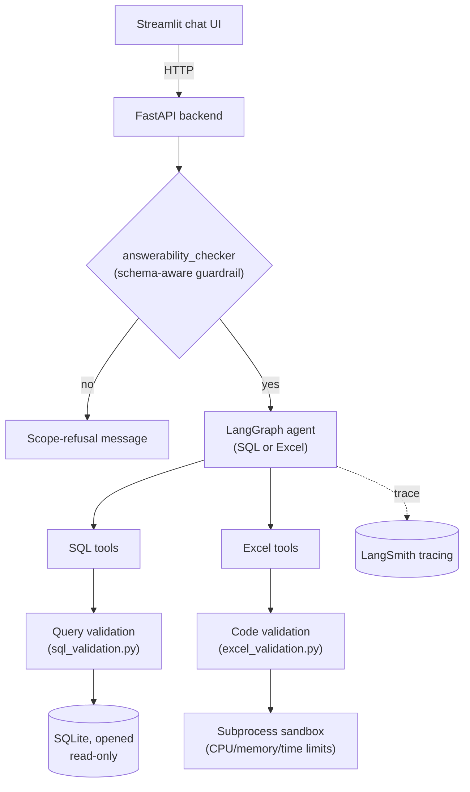

# AI Data Analysis Agent

An LLM agent that answers natural-language questions about a SQL database or an Excel spreadsheet. Ask a question, and it generates and safely executes the SQL query or pandas code needed to answer it, or declines if the connected data can't answer the question.

## Overview

The project has two agents that share a common structure:

1. Inspect the schema of the connected data source (tables/columns for SQL, sheets/columns for Excel).
2. Check whether the question can actually be answered from that schema (`answerability_checker.py`) before doing anything else.
3. Generate a SQL query or pandas snippet with an LLM.
4. Validate the generated code/query before executing it.
5. Execute it under constraints (read-only DB connection, sandboxed subprocess, timeouts, result size limits) and return a formatted answer.

A FastAPI backend exposes this over HTTP, and a Streamlit app provides a chat UI on top of it.

## Architecture



## Project structure

```
.github/workflows/
  ci.yml                     # Lint + unit tests, on every push/PR
  cd.yml                     # Build/push images and deploy, on merge to main
  evaluation.yml             # Manually-triggered evaluation runs
data/
  example_db/                # Sample SQLite database
  example_file/              # Sample Excel workbook
  uploaded_files/            # User-uploaded files
docker/
  backend.Dockerfile
  frontend.Dockerfile
  docker-compose.yml         # Local development
  docker-compose.prod.yml    # Production overrides (pre-built images, no public backend port)
evaluation/
  datasets/                  # Golden question sets (SQL + Excel)
  eval_harness.py            # Evaluation runner
  report_*.json              # Output from past evaluation runs
notebooks/
  01_example_db_setup.ipynb  # How the example SQLite DB was built
src/ai_data_analysis_agent/
  agents/agent.py            # Agent construction and orchestration
  api/routes/                # FastAPI route handlers (query, file upload/removal, health)
  api/schemas.py             # Shared request validation (e.g. session_id format)
  core/                      # Config, logging, LLM provider abstraction, guardrail, file storage, prompts
  tools/                     # SQL/Excel tool implementations and their validation logic
streamlit_app/
  app.py, components.py      # Chat frontend
tests/
  test_sql_validation.py
  test_excel_validation.py
```

## Getting started

### Local development (no Docker)

```bash
git clone <repo-url>
cd ai-data-analysis-agent
pip install -e .
cp .env.example .env   # fill in your LLM provider and langsmith API key

uvicorn ai_data_analysis_agent.main:app --reload &
streamlit run streamlit_app/app.py
```

### With Docker Compose

```bash
docker compose -f docker/docker-compose.yml up --build
```

Frontend: `http://localhost:8501`
Backend: `http://localhost:8000` (health check at `/health`)

### Production deployment

`docker/docker-compose.prod.yml` layers on top of the base compose file for deployment: it pulls pre-built images instead of building locally, and removes the backend's host port mapping so only the frontend is reachable externally (the backend has no authentication of its own, so it shouldn't be directly internet-facing).

```bash
docker compose -f docker/docker-compose.yml -f docker/docker-compose.prod.yml up -d
```

## Configuration

Environment variables (see `.env.example`):

| Variable | Purpose |
|---|---|
| `LLM_PROVIDER` | `groq` or `openai` |
| `GROQ_API_KEY` / `OPENAI_API_KEY` | Credentials for the selected provider |
| `LLM_MODEL` | Model used by the main agent |
| `GUARD_LLM_MODEL` | Smaller/cheaper model used for the answerability check |
| `LANGSMITH_API_KEY`, `LANGSMITH_TRACING`, `LANGSMITH_PROJECT` | Tracing config |

## Safety measures

- **SQL**: the database connection is opened read-only at the SQLite engine level (not just checked in application code). Generated queries are parsed and validated - exactly one statement, no write/DDL keywords anywhere in the statement (including inside CTEs), string literals excluded from the keyword scan to avoid false positives. Queries run with a timeout and results are row/character-capped.
- **Excel**: generated pandas code is validated via AST inspection (no imports, no `eval`/`exec`/`open`, no file-writing DataFrame methods, no dunder attribute access) before execution, then run in an isolated subprocess with CPU, memory, and wall-clock limits.
- **Answerability guardrail**: checks the question against the actual schema before the agent does anything, so it declines out-of-scope questions rather than attempting to answer from general knowledge. Output parsing fails closed (treats ambiguous LLM output as "no") rather than assuming the model always follows the one-word format instruction.
- **File uploads**: size limits, magic-byte validation (not just checking the file extension), and a fixed per-session filename that avoids path-traversal issues from user-supplied filenames.

## Testing

```bash
pytest tests/ -v
```

Covers the SQL and Excel validation logic - the parts of the codebase that decide whether generated code/queries are safe to execute. These are pure functions with no LLM calls, so the tests are fast and deterministic.

## Evaluation

LLM output quality (does the agent answer correctly, does the guardrail refuse the right questions) is checked separately from the unit tests, since it requires real LLM calls and isn't deterministic:

```bash
python evaluation/eval_harness.py
```

This runs the question sets in `evaluation/datasets/` against the live agents and writes a timestamped JSON report. Past runs are kept in `evaluation/report_*.json`.

## CI/CD

Three GitHub Actions workflows:

- **`ci.yml`** - lint and unit tests on every push and pull request.
- **`cd.yml`** - on merge to `main`, builds and pushes the backend/frontend images and deploys them.
- **`evaluation.yml`** - runs `evaluation/eval_harness.py` via manual trigger, kept separate from `ci.yml` since it calls a real LLM and isn't deterministic, so it shouldn't gate every commit.

## Observability

Agent runs are traced via LangSmith - both the LangChain-native agent execution and the additional LLM calls made outside of it (the answerability check, SQL query correction) are traced.

## Tech stack

- LangChain / LangGraph for agent orchestration
- FastAPI (backend), Streamlit (frontend)
- SQLite, pandas/openpyxl
- Groq / OpenAI as LLM providers
- LangSmith for tracing
- Docker / Docker Compose

## Limitations

- The API has no authentication. Session isolation relies on an unguessable session ID, not a login system.
- The evaluation datasets are small and meant to demonstrate the approach (separating deterministic tests from LLM evaluation, checking guardrail behavior on both answerable and out-of-scope questions) rather than provide exhaustive coverage.
- Deployment is a single instance with no redundancy and no TLS termination configured.
- This project is built to demonstrate the engineering practices that real-world agentic systems require in production rather than to be a finished, large-scale product. Scaling this to serve many users in a regulated or high-stakes environment would mean additional work (authentication, secrets management, redundancy), but the core engineering approach here reflects how those systems are actually built.

## License

MIT